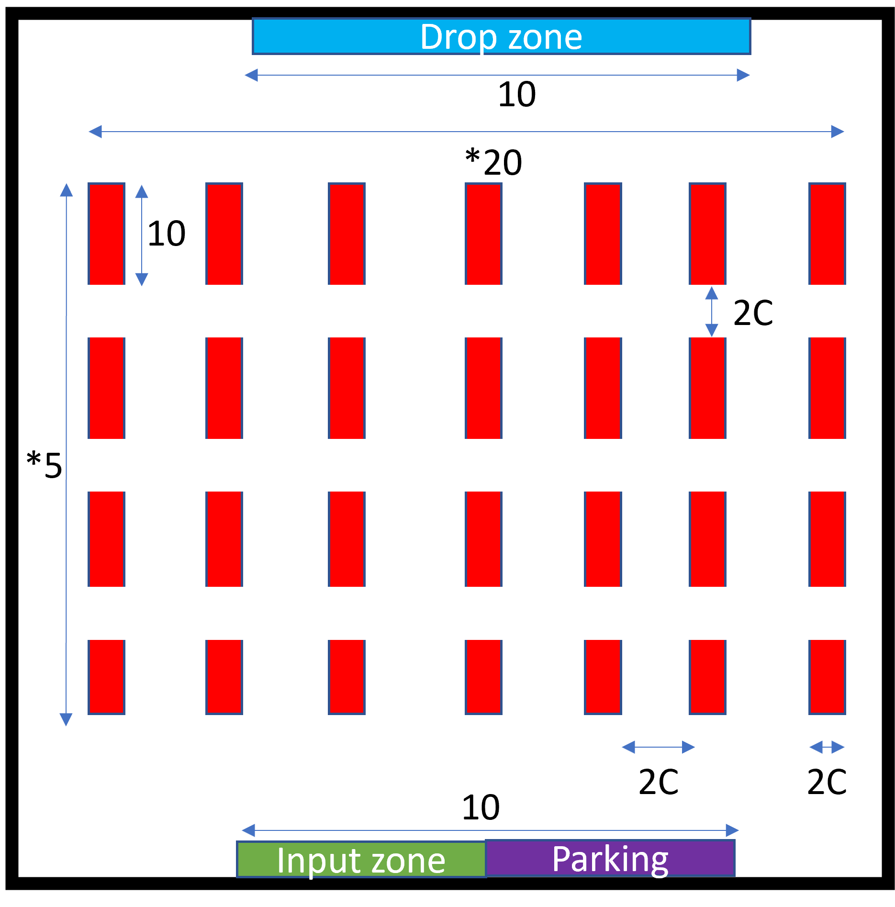

# Warehouse Simulation

- Faire la grille d'étagères
- Faire la methode communicate avec les autres robots (heure commande, état robot, next move,)
- Ajouter l'état du robot (actif, standby, rest)
- Faire génération de colie

Forme object:
- Object: id, object (ex:ordi), poids (ex:3kg), nombre (ex:10), listEtagère, nombre minimum
- Etagère: id, taille , position, encombrement, encombrement max

Warehouse simulation:
